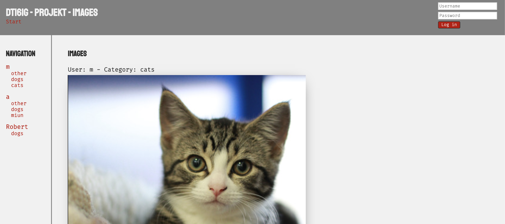
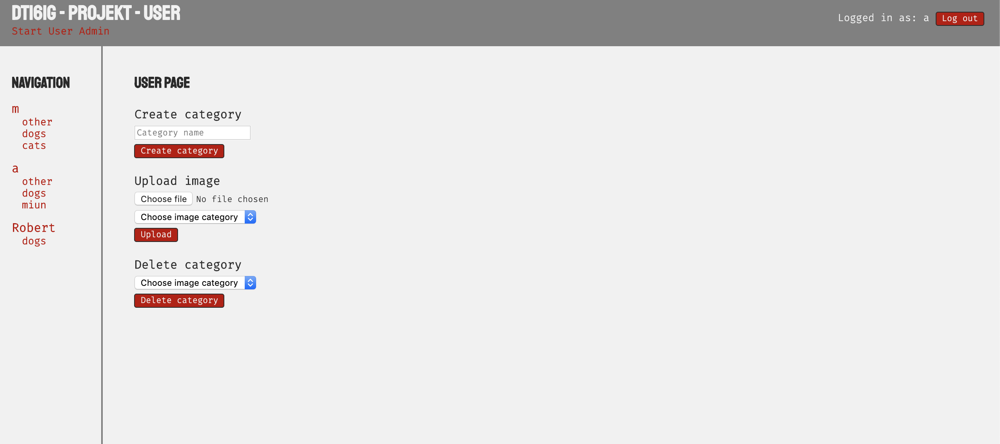
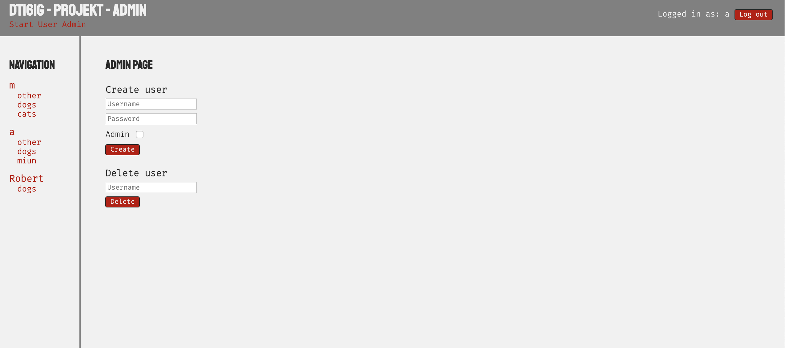

# Image Uploader
Find hosted version [here!](http://studenter.miun.se/~vize1500/dt161g/dt161g/project/)

This is my final project in the course PHP and Postgres at Mittuniversitetet, it is a page that allows uploading of images into private galleries. It also has user handling with admins being able to create and remove user.

## Structure
It runs Postgres server in the backend which stores information about the users and images. PHP classes are used for handling the different roles and communication with the database.

The project was created almost exclusively using PHP, some inline Javascript is involved with displaying messages to the user, but otherwise I tried to only use PHP as much as possible.

